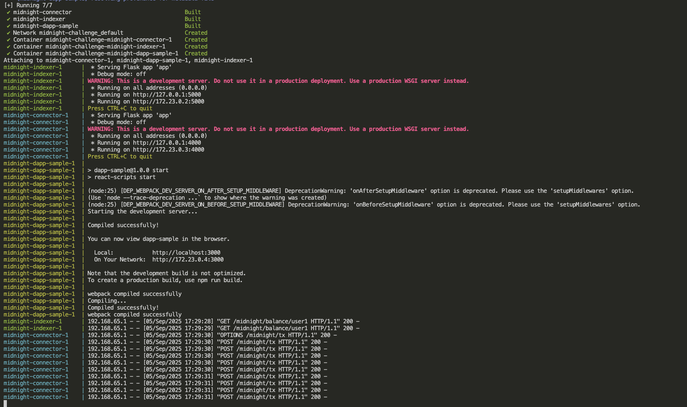
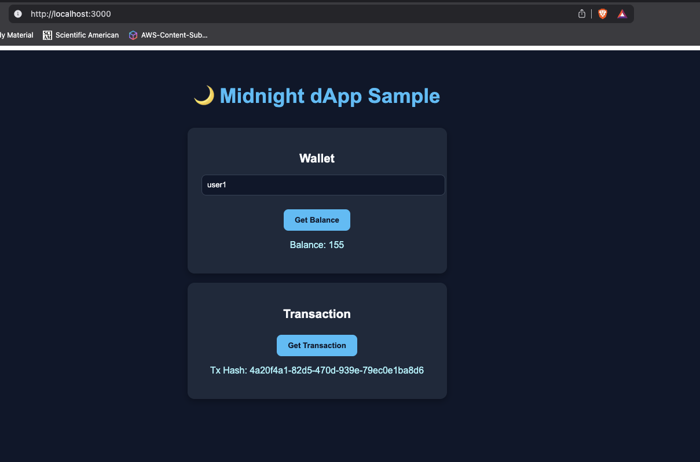

# 🌙 Midnight Dev Docker Starter

A **mock development environment** for building dApps on [Midnight](https://midnight.io).
This project provides a **Dockerized setup** including:

* **Connector Mock (Flask, port 4000)** → simulates sending transactions.
* **Indexer Mock (Flask, port 5000)** → simulates querying balances.
* **React dApp Sample (port 3000)** → minimal UI to interact with the mocks.

This setup lets developers quickly spin up a local Midnight-like playground without installing multiple runtimes manually.

---

## 🚀 Quick Start

Clone the repo and run:

```bash
git clone https://github.com/Pravesh-Sudha/dev-to-challenges.git
cd dev-to-challenges/midnight-challenge
docker-compose up --build
```

### Application Logs


---

## 📂 Project Structure

```
midnight-challenge/
│── docker-compose.yml
│── midnight-connector-mock/   # Flask app simulating Midnight connector
│   ├── app.py
│   ├── requirements.txt
│   └── Dockerfile
│── midnight-indexer-mock/     # Flask app simulating Midnight indexer
│   ├── app.py
│   ├── requirements.txt
│   └── Dockerfile
│── midnight-dapp-sample/      # React dApp to interact with mocks
│   ├── src/
│   ├── public/index.html
│   ├── package.json
│   └── Dockerfile
```

---

## 🌍 Access the Services

Once containers are running:

* React dApp → [http://localhost:3000](http://localhost:3000)
* Connector API → [http://localhost:4000](http://localhost:4000)

  * `POST /tx` → Send a transaction
* Indexer API → [http://localhost:5000](http://localhost:5000)

  * `GET /balance/<address>` → Fetch balance

---

## ✨ Example Usage

1. Open the React dApp in your browser:
   👉 [http://localhost:3000](http://localhost:3000)

2. Enter an address (e.g. `user1`)

3. Click **“Get Balance”**

   * Fetches balance from the indexer mock

4. Click **“Send Tx”**

   * Sends transaction via connector mock
   * Displays returned Tx hash



---

## 🛠 Development Notes

* All services run in the same Docker network via `docker-compose`.
* Flask apps include **CORS enabled** for frontend communication.
* React dev app is exposed on port 3000.

---

## 📜 License

This project is licensed under the **Apache 2.0 License**.
See the [LICENSE](./LICENSE) file for details.


